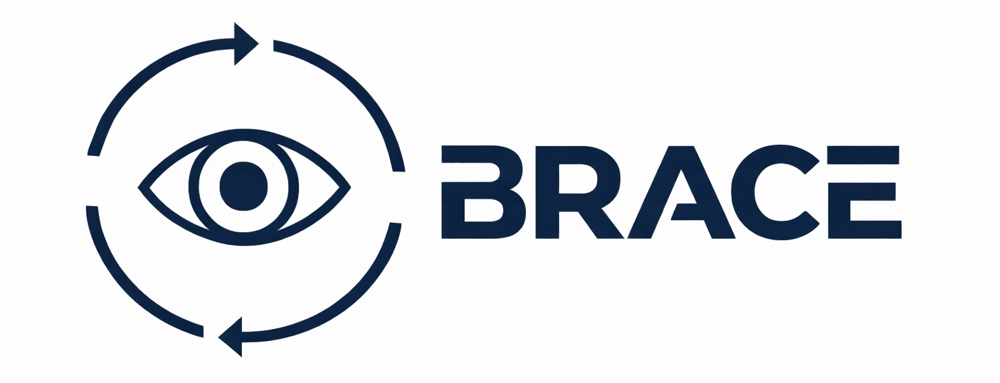

<div align="center">
  <picture>
    <source media="(prefers-color-scheme: dark)" srcset="docs/static/images/logo_dark.png">
    
  </picture>
  <h1>When Replanning Becomes the Bottleneck: Budgeted Embodied Agent Replanning</h1>
</div>

<div align="center">
  <a href="#"></a>
  <a href="https://nebulis-lab.com/BRACE"></a>
  <a href="#"></a>
  <a href="docs/"></a>
</div>

<div align="center">
  <a href="https://www.deepspeed.ai/"></a>
  <a href="https://github.com/microsoft/AirSim"></a>
  <a href="https://aihabitat.org/"></a>
  <a href="https://github.com/MARS-EAI/RoboFactory"></a>
  <a href="https://robosuite.ai/"></a>
  <a href="https://libero-project.github.io/"></a>
  <a href="https://qwen.ai/"></a>
</div>

**BRACE** = **B**udgeted **R**eplanning **a**nd **C**oordination for **E**mbodied-Agents.

This work targets **high-frequency replanning** as a **systems bottleneck** for embodied agents: as context grows (history, perception summaries, retrieved memory), replanning latency develops a heavy tail and leads to **deadline/SLO misses**.

BRACE provides:
- A **budgeted replanning controller** (when to replan, what to include, and how to stay within a time/token budget), and
- **Auditable phase logging** (token + latency accounting on the replanning call path),
and composes with efficiency modules (e.g., **E-RECAP** token pruning, optional retrieval/RAG).

> **Note:** This repository accompanies our ICML 2026 paper.

## Repo map

- **`brace/`**: BRACE controller core (budgeting + stability mechanisms)
- **`experiments/`**: domain runners (Habitat / RoboFactory / AirSim / proxy + stubs)
  - Includes benchmark helpers under `experiments/robosuite/` and `experiments/libero/`
- **`analysis/`**: aggregation + audit tools (tables, schema coverage, trigger/controller audits)
  - Start here: [`analysis/README.md`](analysis/README.md)
- **`docs/`**: project page + guides
  - Website: [`docs/index.html`](docs/index.html)
  - Main guide: [`docs/README.md`](docs/README.md)
  - External benchmark notes: [`docs/EXTERNAL_BENCHMARKS.md`](docs/EXTERNAL_BENCHMARKS.md)
  - Controller spec: [`docs/CONTROLLER.md`](docs/CONTROLLER.md)
  - Logging schema: [`docs/SCHEMA.md`](docs/SCHEMA.md)
  - Demo/media provenance: [`docs/PROVENANCE.md`](docs/PROVENANCE.md)
  - E-RECAP guide: [`docs/e-recap.md`](docs/e-recap.md)
- **`configs/`**: curated configs
  - Defaults: `configs/smoke/` (sanity checks)
  - Paper-facing: `configs/experiments/` (curated eval/demo configs)
- **`scripts/`**: thin wrappers around Python entrypoints (smoke / run / postprocess)
- **`e-recap/`**: vendored E-RECAP module (optional)
- **`third_party/openmarl/`**: vendored OpenMARL components used by the VLA executor track


## Quickstart (local smoke; no simulators required)

```bash
python -m venv .venv
source .venv/bin/activate
pip install -r requirements.txt

# Validates: run directory + schema + postprocess tables.
scripts/smoke_local.sh
```

## Run (requires simulators / external assets)

These wrappers invoke the python entrypoints under `experiments/` and write results to `runs/`:

```bash
# Meta AI Habitat (requires local habitat-setup + MP3D license assets)
scripts/run_habitat.sh --config configs/smoke/habitat_setup.json --run-name habitat_smoke

# RoboFactory (requires RoboFactory runtime + assets)
scripts/run_robofactory.sh --config configs/smoke/robofactory_lift_barrier.json --run-name robofactory_smoke

# Microsoft AirSim (requires UE binaries + BRACE_AIRSIM_ENVS_ROOT)
scripts/run_airsim.sh --config configs/smoke/airsim_multidrone_demo.json --run-name airsim_demo --ue-env airsimnh
```

Additional helper wrappers are also available for benchmark-native qualitative workflows:

```bash
# RoboSuite offscreen rendering / playback / demo collection
scripts/run_robosuite_render.sh --help
scripts/run_robosuite_playback.sh --help
scripts/run_robosuite_collect.sh --help

# LIBERO suite inspection / task rendering
scripts/run_libero_check.sh --help
scripts/run_libero_render.sh --help
```

## Reproducibility & auditing (paper-facing tables)

This repo uses an on-disk, auditable run format:

- `runs/<run_id>/run.json`
- `runs/<run_id>/events.jsonl`
- `runs/<run_id>/episode_metrics.jsonl`

To postprocess a run into paper-facing tables:

```bash
scripts/postprocess_run.sh runs/<run_id>
```

This performs strict schema checks and writes markdown tables under `artifacts/tables/`. See:
- `docs/SCHEMA.md` for field definitions
- `docs/PROVENANCE.md` for committed demo media provenance

## Citation

Coming soon.

## Repo policy (open-source)

This repository is **code + configs + docs only**.

- Do not commit large weights/datasets/videos; keep them under your `BRACE_MODELS_ROOT` / `BRACE_DATA_ROOT` and reference via env vars.
- Local outputs are generated at runtime (e.g., `runs/`, `artifacts/`, `data/`) and are **not** shipped in this repo. See `docs/LOCAL_OUTPUTS.md`.
